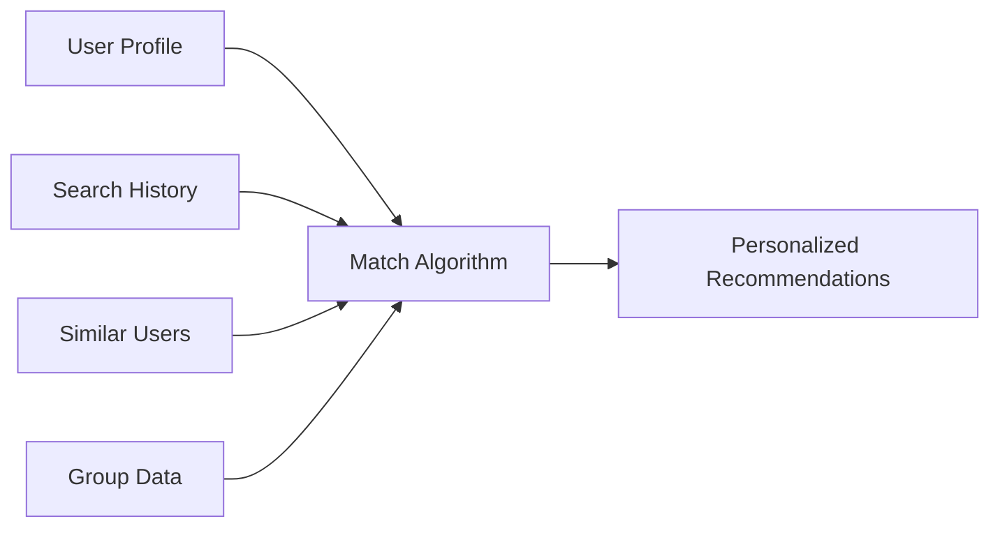

<div align="center">

# 🎓 StudyHub

### Collaborative Study Group Platform

[](https://www.python.org/downloads/)
[](https://www.djangoproject.com/)
[](LICENSE)
[](CONTRIBUTING.md)


**[🚀 Live Demo](https://studyhub-demo.herokuapp.com)** • 
**[📖 Documentation](https://docs.studyhub.com)** • 
**[🐛 Report Bug](https://github.com/yourusername/studyhub/issues)** • 
**[✨ Request Feature](https://github.com/yourusername/studyhub/issues)**

---

### A comprehensive web-based platform that helps students create, discover, and join study groups for their courses.

Built with ❤️ using Django, Bootstrap 5, and modern web technologies.

</div>

---

## 📋 Table of Contents

<details>
<summary>Click to expand</summary>

- [✨ Features](#-features)
- [🎯 Why StudyHub?](#-why-studyhub)
- [🚀 Quick Start](#-quick-start)
- [📂 Project Structure](#-project-structure)
- [🛠️ Technology Stack](#️-technology-stack)
- [📸 Screenshots](#-screenshots)
- [🎨 Key Features Explained](#-key-features-explained)
- [🔧 Configuration](#-configuration)
- [📚 API Documentation](#-api-documentation)
- [🧪 Testing](#-testing)
- [🚀 Deployment](#-deployment)
- [🤝 Contributing](#-contributing)
- [📝 License](#-license)
- [👨‍💻 Authors](#-authors)
- [🙏 Acknowledgments](#-acknowledgments)

</details>

---

## ✨ Features

<table>
<tr>
<td width="50%">

### 🎯 Core Functionality

<ul>
<li>👥 <strong>User Authentication & Profiles</strong><br/>
<sub>Secure registration, login, and customizable student profiles</sub></li>

<li>📚 <strong>Study Group Management</strong><br/>
<sub>Create public/private groups with course-specific details</sub></li>

<li>📅 <strong>Session Scheduling</strong><br/>
<sub>Schedule study sessions with RSVP system</sub></li>

<li>🏠 <strong>Personalized Dashboard</strong><br/>
<sub>View active groups, upcoming sessions, and recommendations</sub></li>

<li>🔍 <strong>Smart Search & Discovery</strong><br/>
<sub>Browse and filter groups by course, location, schedule</sub></li>
</ul>

</td>
<td width="50%">

### 🚀 Advanced Features

<ul>
<li>💬 <strong>Group Chat</strong><br/>
<sub>Real-time messaging system for group communication</sub></li>

<li>🎯 <strong>Smart Recommendations</strong><br/>
<sub>AI-powered group suggestions based on profile</sub></li>

<li>🔔 <strong>Notifications</strong><br/>
<sub>Session reminders, join requests, and real-time alerts</sub></li>

<li>📊 <strong>Analytics Dashboard</strong><br/>
<sub>Attendance rates, member growth, session statistics</sub></li>

<li>🏆 <strong>Gamification</strong><br/>
<sub>Badges, streaks, leaderboard, and achievements</sub></li>
</ul>

</td>
</tr>
</table>

---

## 🎯 Why StudyHub?

<div align="center">

| 🎓 For Students | 👨‍🏫 For Educators | 🏫 For Institutions |
|----------------|-------------------|---------------------|
| Find study partners easily | Track student engagement | Enhance collaborative learning |
| Organize study sessions | Monitor group activities | Improve academic outcomes |
| Earn achievements | Access analytics | Foster community building |
| Stay motivated with gamification | Support student success | Gain valuable insights |

</div>

---

## 🚀 Quick Start

<details open>
<summary><b>💻 Installation Guide</b></summary>

### Prerequisites

```bash
✓ Python 3.8 or higher
✓ pip (Python package manager)
✓ virtualenv (recommended)
✓ PostgreSQL (for production) or SQLite (for development)
```

### Installation Steps

#### 1️⃣ Clone the repository

```bash
git clone https://github.com/yourusername/studyhub.git
cd studyhub
```

#### 2️⃣ Create virtual environment

```bash
# Windows
python -m venv venv
venv\Scripts\activate

# Linux/Mac
python3 -m venv venv
source venv/bin/activate
```

#### 3️⃣ Install dependencies

```bash
pip install -r requirements.txt
```

#### 4️⃣ Configure environment variables

```bash
cp .env.example .env
# Edit .env file with your configuration
```

#### 5️⃣ Run migrations

```bash
python manage.py makemigrations
python manage.py migrate
```

#### 6️⃣ Create superuser

```bash
python manage.py createsuperuser
```

#### 7️⃣ Collect static files (production only)

```bash
python manage.py collectstatic --noinput
```

#### 8️⃣ Run development server

```bash
python manage.py runserver
```

<div align="center">

🎉 **Success!** Visit [http://127.0.0.1:8000](http://127.0.0.1:8000) in your browser.

</div>

</details>

---

## 📂 Project Structure

```
studyhub/
│
├── 📁 accounts/              # User authentication & profiles
│   ├── models.py            # User profile model
│   ├── views.py             # Authentication views
│   ├── forms.py             # Registration & profile forms
│   └── templates/           # Auth templates
│
├── 📁 analytics/             # Analytics & insights
│   ├── models.py            # Analytics models
│   ├── utils.py             # Analytics calculations
│   └── views.py             # Dashboard views
│
├── 📁 chat/                  # Group messaging
│   ├── models.py            # Message models
│   └── views.py             # Chat views
│
├── 📁 dashboard/             # User dashboard
│   └── views.py             # Dashboard logic
│
├── 📁 gamification/          # Badges, streaks, achievements
│   ├── models.py            # Badge & streak models
│   ├── utils.py             # Gamification logic
│   └── views.py             # Achievement views
│
├── 📁 groups/                # Study group management
│   ├── models.py            # Group models
│   ├── views.py             # Group CRUD operations
│   └── forms.py             # Group forms
│
├── 📁 notifications/         # Notification system
│   ├── models.py            # Notification models
│   ├── utils.py             # Notification helpers
│   └── views.py             # Notification views
│
├── 📁 recommendations/       # Smart recommendations
│   ├── models.py            # Recommendation models
│   ├── utils.py             # Recommendation algorithm
│   └── views.py             # Recommendation views
│
├── 📁 sessions/              # Session scheduling
│   ├── models.py            # Session & RSVP models
│   ├── views.py             # Session management
│   └── forms.py             # Session forms
│
├── 📁 static/                # Static files (CSS, JS, images)
│   ├── css/
│   ├── js/
│   └── images/
│
├── 📁 media/                 # User uploads
│   └── profile_pictures/
│
├── 📁 templates/             # Global templates
│   ├── base.html
│   ├── navbar.html
│   └── home.html
│
├── 📁 studygroup_platform/   # Main project settings
│   ├── settings.py
│   ├── urls.py
│   └── wsgi.py
│
├── 📄 manage.py
├── 📄 requirements.txt
├── 📄 .env.example
├── 📄 .gitignore
├── 📄 Procfile              # Heroku deployment
├── 📄 Dockerfile            # Docker support
├── 📄 docker-compose.yml    # Docker composition
└── 📄 README.md
```

---

## 🛠️ Technology Stack

<div align="center">

### Backend


### Frontend


### Tools & Libraries


</div>

---

## 📸 Screenshots

<details>
<summary><b>🖼️ Click to view screenshots</b></summary>

### 🏠 Dashboard


*Personalized dashboard showing active groups, upcoming sessions, and recommendations*

---

### 🔍 Group Discovery


*Browse and search study groups with advanced filters*

---

### 📊 Analytics Dashboard


*Comprehensive analytics with charts and statistics*

---

### 🏆 Gamification


*Badges, streaks, and leaderboard system*

---

### 💬 Group Chat


*Real-time messaging within study groups*

</details>

---

## 🎨 Key Features Explained

<details>
<summary><b>🎯 Smart Recommendations Algorithm</b></summary>

### How it works:



**Factors considered:**
- 🎓 Department matching (+30 points)
- 📚 Semester/year similarity (+20 points)
- 🔍 Search history match (+25 points)
- 👥 Similar user behavior (+15 points)
- 👁️ Recently viewed groups (+10 points)
- 🌐 Group accessibility (+5 points)

</details>

<details>
<summary><b>🏆 Gamification System</b></summary>

### Badge Categories

| Badge Type | Bronze | Silver | Gold | Platinum |
|------------|--------|--------|------|----------|
| 🌱 **Group Founder** | 1 group | 3 groups | 5 groups | 10 groups |
| 📅 **Session Creator** | 5 sessions | 15 sessions | 30 sessions | 50 sessions |
| ✅ **Perfect Attendance** | 10 sessions | 25 sessions | 50 sessions | 100 sessions |
| 💬 **Social Butterfly** | 50 messages | 200 messages | 500 messages | 1000 messages |
| 🔥 **Streak Master** | 4 weeks | 8 weeks | 12 weeks | 20 weeks |

### Points System

- 🎯 Attending sessions: **5 points**
- 📅 Creating sessions: **10 points**
- 🏆 Earning badges: **10-300 points**
- ⭐ Special achievements: **50-150 points**

### Leveling

- **Level = Total Points ÷ 100**
- Each level requires 100 additional points
- Unlimited levels!

</details>

<details>
<summary><b>📊 Analytics Features</b></summary>

### For Group Creators:

- 📈 **Attendance Trends** - 8-week attendance rate visualization
- 👥 **Member Growth** - 6-month member growth timeline
- 📅 **Session Frequency** - Monthly session statistics
- 🏆 **Top Contributors** - Most active members leaderboard
- 📊 **Detailed Metrics** - Individual member activity breakdown

### Charts Available:

- Line charts for trends
- Bar charts for comparisons
- Progress indicators
- Real-time statistics

</details>

<details>
<summary><b>🔔 Notification System</b></summary>

### Notification Types:

| Type | Trigger | Recipients |
|------|---------|------------|
| 📅 Session Reminder | 24 hours before | Attending members |
| 👋 Join Request | User requests | Group creator |
| ✅ Request Approved | Approval | Requesting user |
| ❌ Request Rejected | Rejection | Requesting user |
| 🎉 New Member | User joins | All members |
| 📚 Session Created | New session | All members |
| ⚠️ Session Cancelled | Cancellation | All members |

### Customization:

Users can enable/disable:
- In-app notifications
- Email notifications
- Per notification type preferences

</details>

---

## 🔧 Configuration

<details>
<summary><b>⚙️ Environment Variables</b></summary>

Create a `.env` file in the root directory:

```env
# Django Settings
SECRET_KEY=your-secret-key-here-generate-new-one
DEBUG=True
ALLOWED_HOSTS=localhost,127.0.0.1

# Database Configuration
DB_ENGINE=django.db.backends.postgresql
DB_NAME=studyhub_db
DB_USER=postgres
DB_PASSWORD=your-password
DB_HOST=localhost
DB_PORT=5432

# Email Configuration (for notifications)
EMAIL_BACKEND=django.core.mail.backends.smtp.EmailBackend
EMAIL_HOST=smtp.gmail.com
EMAIL_PORT=587
EMAIL_USE_TLS=True
EMAIL_HOST_USER=your-email@gmail.com
EMAIL_HOST_PASSWORD=your-app-password
DEFAULT_FROM_EMAIL=noreply@studyhub.com

# Security Settings (Production)
SECURE_SSL_REDIRECT=False
SESSION_COOKIE_SECURE=False
CSRF_COOKIE_SECURE=False

# Application Settings
SITE_NAME=StudyHub
SITE_URL=http://localhost:8000
```

</details>

---

## 📚 API Documentation

<details>
<summary><b>📖 Key Models</b></summary>

### User Profile
```python
class UserProfile:
    user: OneToOneField(User)
    university: CharField(max_length=200)
    department: CharField(max_length=200)
    semester: CharField(choices=SEMESTER_CHOICES)
    year: CharField(choices=YEAR_CHOICES)
    profile_picture: ImageField()
    bio: TextField()
    phone: CharField()
```

### Study Group
```python
class StudyGroup:
    name: CharField(max_length=200)
    course_name: CharField(max_length=200)
    course_code: CharField(max_length=50)
    max_capacity: IntegerField(3-10)
    group_type: CharField('public' or 'private')
    meeting_days: CharField()
    meeting_time: TimeField()
    meeting_location: CharField()
    creator: ForeignKey(User)
    members: ManyToManyField(User)
```

### Study Session
```python
class StudySession:
    group: ForeignKey(StudyGroup)
    title: CharField(max_length=200)
    description: TextField()
    date: DateField()
    time: TimeField()
    duration: IntegerField()  # minutes
    location: CharField(max_length=200)
    created_by: ForeignKey(User)
    is_cancelled: BooleanField()
```

</details>

---

## 🧪 Testing

<details>
<summary><b>🔬 Running Tests</b></summary>

### Run all tests
```bash
python manage.py test
```

### Run tests with coverage
```bash
coverage run --source='.' manage.py test
coverage report
coverage html  # Generate HTML report
```

### Run specific app tests
```bash
python manage.py test accounts
python manage.py test groups
python manage.py test sessions
```

### Run with verbose output
```bash
python manage.py test --verbosity=2
```

</details>

---

## 🚀 Deployment

<div align="center">

### Choose Your Platform

[](DEPLOYMENT.md#heroku-deployment)
[](DEPLOYMENT.md#digitalocean-deployment)
[](DEPLOYMENT.md#aws-deployment)
[](DEPLOYMENT.md#docker-deployment)

</div>

<details>
<summary><b>🚢 Quick Deploy Commands</b></summary>

### Heroku
```bash
heroku create your-app-name
git push heroku main
heroku run python manage.py migrate
heroku run python manage.py createsuperuser
```

### Docker
```bash
docker-compose up --build
```

### Manual Server
```bash
gunicorn studygroup_platform.wsgi:application \
    --bind 0.0.0.0:8000 \
    --workers 3
```

</details>

📖 **[Read Full Deployment Guide](DEPLOYMENT.md)**

---

## 🤝 Contributing

<div align="center">

We love contributions! ❤️

[](https://github.com/yourusername/studyhub/graphs/contributors)
[](https://github.com/yourusername/studyhub/network/members)
[](https://github.com/yourusername/studyhub/stargazers)
[](https://github.com/yourusername/studyhub/issues)

</div>

### How to Contribute

1. 🍴 Fork the Project
2. 🌿 Create your Feature Branch (`git checkout -b feature/AmazingFeature`)
3. ✍️ Commit your Changes (`git commit -m 'Add some AmazingFeature'`)
4. 📤 Push to the Branch (`git push origin feature/AmazingFeature`)
5. 🎉 Open a Pull Request

### Code Style

- ✅ Follow PEP 8 guidelines
- ✅ Write meaningful commit messages
- ✅ Add docstrings to functions
- ✅ Write unit tests for new features
- ✅ Update documentation

📖 **[Read Full Contributing Guide](CONTRIBUTING.md)**

---

## 📝 License

<div align="center">

This project is licensed under the **MIT License**

[](LICENSE)

See [LICENSE](LICENSE) file for details.

</div>

---

## 👨‍💻 Authors

<div align="center">

<table>
<tr>
<td align="center">
<a href="https://github.com/Fahad13-jpg">
<br />
<sub><b>Muhammad Fahad</b></sub>
</a><br />
<sub>Project Creator</sub>
</td>
</tr>
</table>

### Contact

📧 Email: [your.email@example.com](mailto:mohmmadfahad53408@gmail.com)

🔗 Project Link: [https://github.com/Fahad13-jpg/studyhub](https://github.com/Fahad13-jpg/studyhub)

🌐 Live Demo: [https://studyhub-demo.herokuapp.com](https://studyhub-demo.herokuapp.com)

</div>

---

## 🙏 Acknowledgments

<div align="center">

Special thanks to:

- [Django](https://www.djangoproject.com/) - The web framework for perfectionists
- [Bootstrap](https://getbootstrap.com/) - Front-end framework
- [Font Awesome](https://fontawesome.com/) - Icon library
- [Chart.js](https://www.chartjs.org/) - Charts and graphs
- All our amazing [contributors](https://github.com/yourusername/studyhub/graphs/contributors)

</div>

---

## 📊 Project Status

<div align="center">


</div>

### Roadmap

- [x] ✅ Core features
- [x] ✅ User authentication
- [x] ✅ Group management
- [x] ✅ Session scheduling
- [x] ✅ Gamification
- [x] ✅ Analytics
- [ ] 🚧 Calendar view (v1.1)
- [ ] 🚧 Advanced roles (v1.1)
- [ ] 🚧 Progress tracking (v1.2)
- [ ] 🚧 Session feedback (v1.2)
- [ ] 📅 Mobile app (v2.0)
- [ ] 📅 Video conferencing (v2.0)

---

## 🐛 Known Issues

<div align="center">

[](https://github.com/Fahad13-jpg/studyhub/issues)
[](https://github.com/Fahad13-jpg/studyhub/issues?q=is%3Aissue+is%3Aclosed)

Currently, there are no known critical issues. 

Found a bug? [Report it here](https://github.com/Fahad13-jpg/studyhub/issues/new)

</div>

---

## 🔄 Changelog

<div align="center">

### Version 1.0.0 (2024-11-10)

**🎉 Initial Release**

</div>

**Features:**
- ✨ User authentication & profiles
- ✨ Study group management
- ✨ Session scheduling with RSVP
- ✨ Group chat system
- ✨ Smart recommendations
- ✨ Notification system
- ✨ Analytics dashboard
- ✨ Gamification (badges, streaks, leaderboard)

📖 **[View Full Changelog](CHANGELOG.md)**

---

<div align="center">

## ⭐ Show Your Support

**If you found this project helpful, please consider giving it a ⭐**

[](https://star-history.com/#Fahad13-jpg/studyhub&Date)

---

### 💝 Support the Project

<a href="https://www.buymeacoffee.com/Fahad13-jpg" target="_blank">

</a>

---

**Made with ❤️ for students, by developers**

**StudyHub** • Empowering Collaborative Learning

© 2024 StudyHub. All rights reserved.

</div>